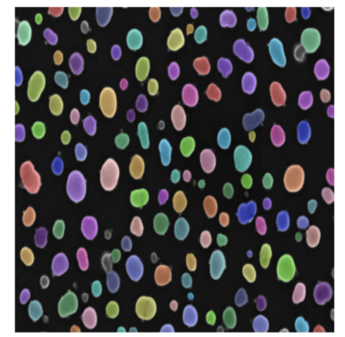
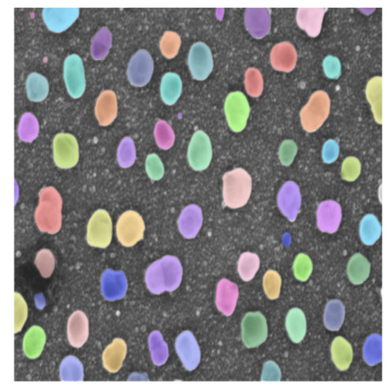
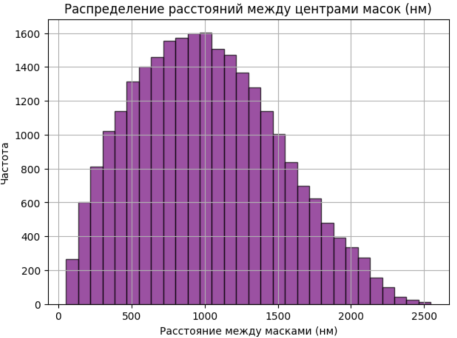
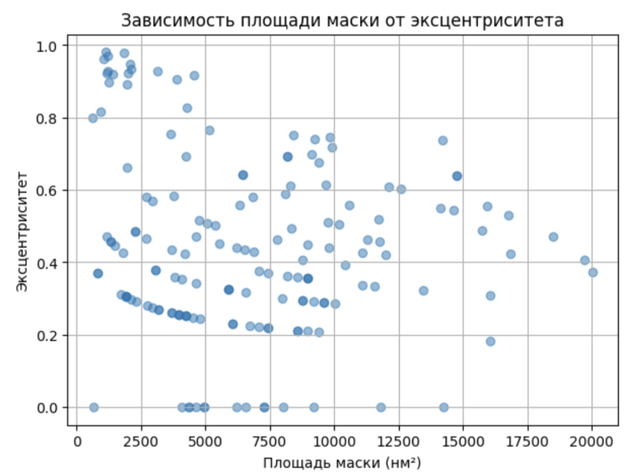
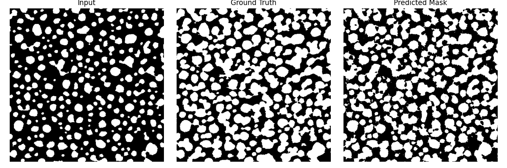
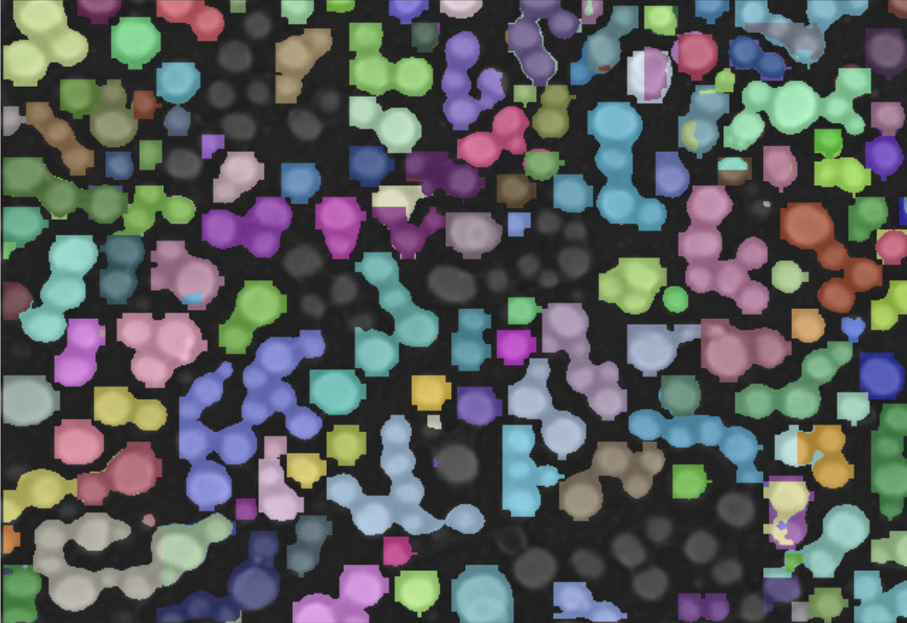

# PhotonQ

**PhotonQ** — проект, направленный на разработку доступного инструмента для оценки качества нанофотонных структур с применением технологий глубокого обучения и плазмон-индуцированной радикальной полимеризации.  
Данная работа выполнена при поддержке программы исследовательских проектов в области искусственного интеллекта Университета ИТМО (НИРсИИ) №640098.
Результаты, полученные в рамках выполнения проекта, закладывают основу для создания инструмента оценки качества нанофотонных структур, разрабатываемого в рамках проекта. В дальнейшем интеграция текущих и последующих результатов позволит сформировать комплексный подход, обеспечивающий количественную оценку усиления электромагнитного поля образца на основе
спектральных характеристик его поглощения.

---
## Идея проекта

Нанофотонные структуры, в частности плазмонные наноструктуры, играют решающую роль в современных приложениях, таких как датчики, фотонные чипы и передовые функциональные наноустройства. Ключевым параметром для оценки производительности этих систем является коэффициент усиления электромагнитного поля, который зависит от геометрии и взаимодействия наночастиц.

Уникальное взаимное расположение и одновременное взаимодействие множества групп наночастиц между друг другом и между группами кратно усложняет получение оценки производительности и качества подобной структуры требуя значительных вычислительных ресурсов для предсказания коэффициента усиления электромагнитного поля.

Данный проект нацелен на решение ряда проблем, которые препятствуют внедрению быстродействующего автоматического контроля качества плазмонных структур. В частности, предлагается использование Pix2Pix GAN модели для предсказания карты распределения усиления электромагнитного поля вблизи плазмонных структур, а также использование модели MLP+CNN для получения общей оценки качества структуры QF (Quality Factor) на основе спектральных характеристик реальных образцов.

---

В работе реализованы 2 модели: Pix2Pix GAN и MLP+CNN. Первая используется для предсказания распределения поля вблизи плазмонных структур. Обучение происходило на реальных SEM-изображениях плазмонных частиц покрытых полимерной оболочкой, которая повторяла распределение поля. В силу физических особенностей на SEM-изображениях видно, что полимер сформировался неравномерно, а в зависимости от удаления от источника облучения. Это позволяет разбить изображение на сегменты и предсказывать распределение поля не с одним пороговым значением, а собирать тепловые карты. 

Разбив изображения на ещё более мелкие сегменты и наложив бинарную маску с различным порогом отсечения, мы получали двух-цветные изображения а)только частиц; б)частиц с полимером. Обучив на этих парах модель с дополнительным предиктором в виде степени заполимиризованности, на выходе мы получаем картированные изображения наночастиц с распределением поля вокруг них. Таким образом, для предсказания распределения поля вблизи плазмонных структур первой модели нужны лишь SEM-изображение подобных частиц.

На основе предсказанных изображений можно выделить наиболее взаимодействующие (связанные) частицы, для численного моделирования их спектральных характеристик, а также можно получить значение QF основываясь на площади занимаемого полем ограниченным пороговым значением. Эти данные и легли во вторую модель 

Втора модель способна предсказать значение QF опираясь исключительно на спектральных характеристики исследуемого образца. Она обучалась на спектральных характеристиках групп частиц, выделенных первой моделью и на значении QF, которые также получались из выходных данных Pix2Pix GAN модели. 

Выбор подобного алгоритма обучения и определённых моделей обусловлен рядом причин:

*(Почему именно Pix2Pix GAN? Сравнение с YOLO)*

текст и описание тут.

*(Сравнение предсказаний формирования групп с помощью графов и Pix2Pix GAN)*

текст и описание тут.

Подробнее про работу моделей и их особенности можно почитать тут: {Ссылки на наши статьи}

Как работать с моделями

*(Особенности работы модели, которые важны для конечного пользователя)*

текст и описание тут.

## Особенности SEM-изображений частиц

- Сложная разметка: большое количество объектов на изображениях.
- Разный размер частиц: от микронов до нанометров.
- Требуется настройка цвета и контрастности перед обработкой.

---

## Сегментация частиц с помощью SAM

На основе подготовленного датасета SEM-изображений была дообучена модель **SAM (Segment Anything Model)**.

### Результаты сегментации:

  
  

---

## Анализ физических характеристик частиц

После получения масок сегментации проведён количественный анализ:

- Общее количество частиц
- Средний размер частиц  
- Средний эксцентриситет  
- Заполняемость изображения частицами
- Плотность частиц на 1 нм²
- Распределение расстояний между центрами частиц  

**Визуализация результатов:**

  
  

---

## Предсказание структуры полимера по частицам

На основе распределения частиц осуществляется предсказание структуры полимера — ключевого индикатора распределения поля и качества образца.

### Используемая модель: `pix2pix` (PyTorch)

- На вход подавались **бинарные маски** частиц и соответствующие изображения полимеров.
- Маски получены с помощью `cv2` с ручной настройкой цветовых порогов.

#### Метрики качества:

| Метрика | Значение |
|--------|----------|
| Dice   | 0.83  |
| IoU    | 0.73   |
| MAE    | 21.04  |
| RMSE   | 0.39   |
| SSIM   | 0.51   |
| PSNR   | 8.35   |

### Визуализация результата:

---

## Альтернативный подход: YOLOv8Seg

Также протестирован подход генерации полимерной структуры с использованием **YOLOv8Seg**, обученного на тех же парах "частицы-полимер".

  

---

## Поддержка

Проект выполняется в рамках гранта **НИРСИИ**.  

