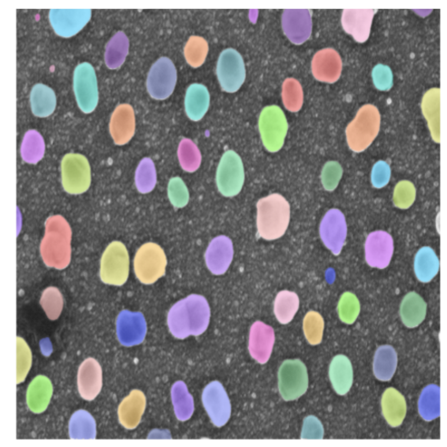
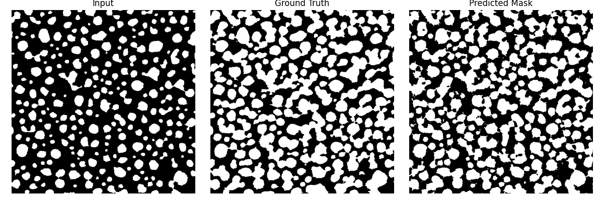

# AISEM

**AISEM (AI for Scanning Electron Microscopy)** — проект, направленный на автоматизацию анализа SEM-изображений частиц и предсказание структуры полимеров. Выполнен в рамках гранта НИРСИИ.

---

## Особенности SEM-изображений частиц

- Сложная разметка: большое количество объектов на изображениях.
- Разный размер частиц: от микронов до нанометров.
- Требуется настройка цвета и контрастности перед обработкой.

---

## Сегментация частиц с помощью SAM

На основе подготовленного датасета SEM-изображений была дообучена модель **SAM (Segment Anything Model)**.

### Результаты сегментации:

  
  

---

## Анализ физических характеристик частиц

После получения масок сегментации проведён количественный анализ:

- Общее количество частиц
- Средний размер частиц  
- Средний эксцентриситет  
- Заполняемость изображения частицами
- Плотность частиц на 1 нм²
- Распределение расстояний между центрами частиц  

**Визуализация результатов:**

  
  

---

## Предсказание структуры полимера по частицам

На основе распределения частиц осуществляется предсказание структуры полимера — ключевого индикатора распределения поля и качества образца.

### Используемая модель: `pix2pix` (PyTorch)

- На вход подавались **бинарные маски** частиц и соответствующие изображения полимеров.
- Маски получены с помощью `cv2` с ручной настройкой цветовых порогов.

#### Метрики качества:

| Метрика | Значение |
|--------|----------|
| Dice   | 0.83  |
| IoU    | 0.73   |
| MAE    | 21.04  |
| RMSE   | 0.39   |
| SSIM   | 0.51   |
| PSNR   | 8.35   |

### Визуализация результата:

---

## Альтернативный подход: YOLOv8Seg

Также протестирован подход генерации полимерной структуры с использованием **YOLOv8Seg**, обученного на тех же парах "частицы-полимер".

  

---

## Поддержка

Проект выполняется в рамках гранта **НИРСИИ**.  

